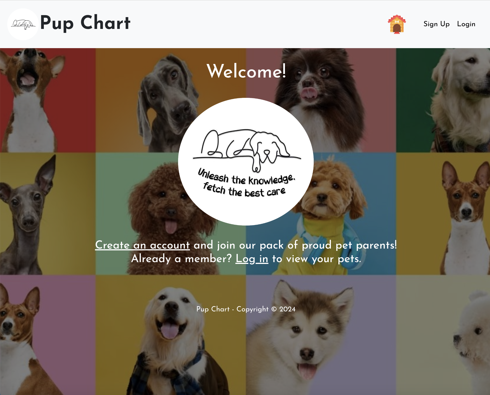
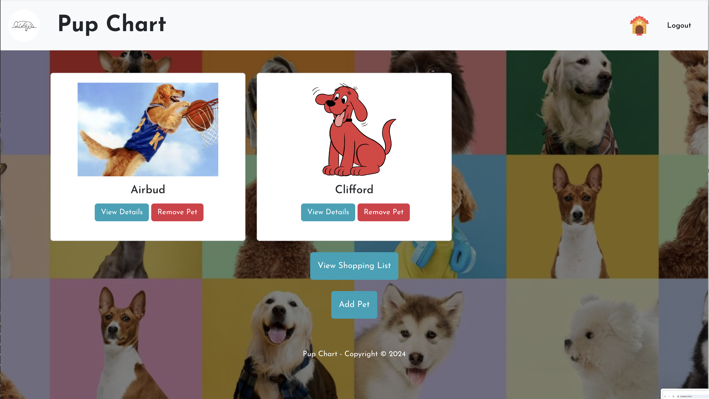
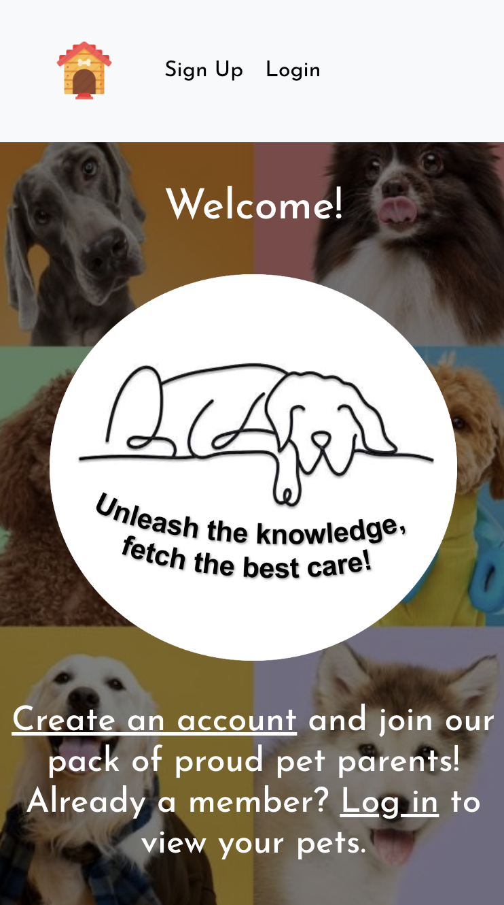
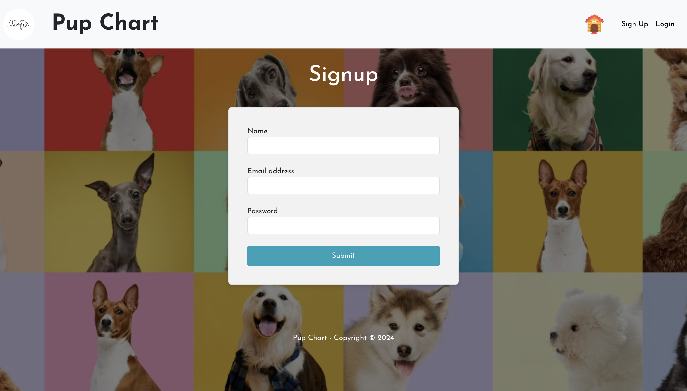
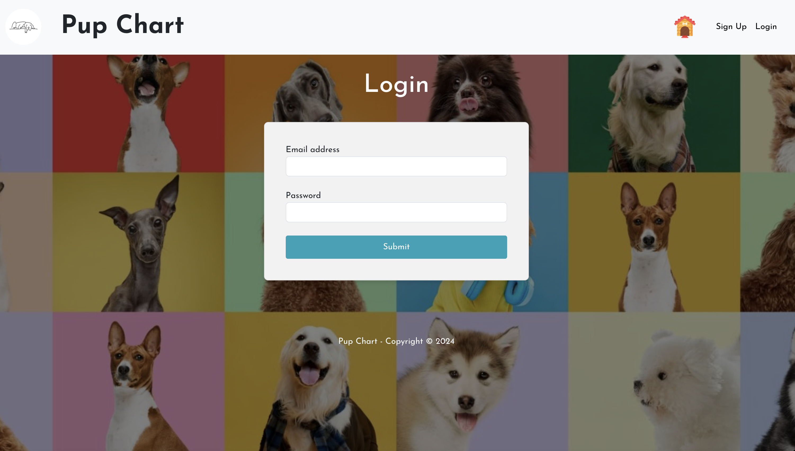
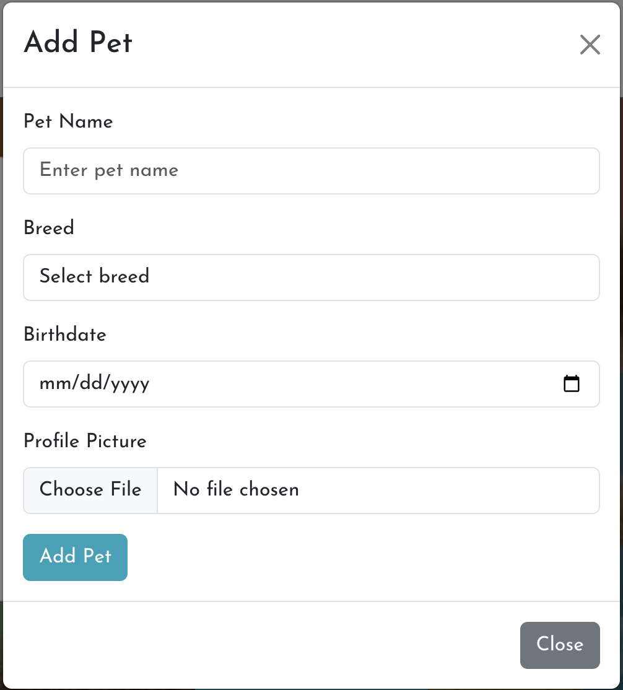
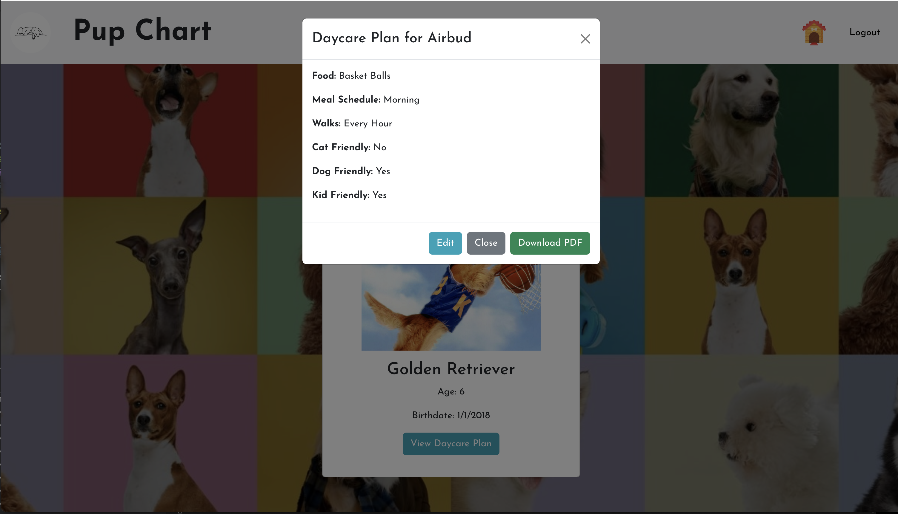
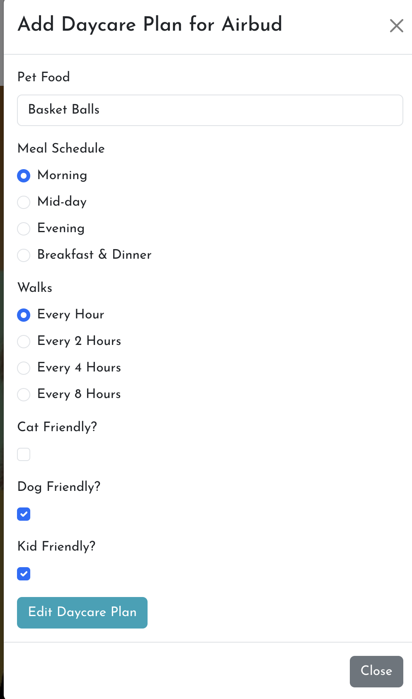

# Pup Chart

Welcome to Pup Chart, your go-to for storing everything to know about your pet!


## Table of Contents

- [Project Overview](#project-overview)
- [Features](#features)
- [Summary](#summary)
- [Installation](#installation-and-usage)
- [Implementation](#implementation)
- [Unit Test Implementation](#unit-test-implementation)
- [Pages](#pages)
- [Credits](#credits)

## Project Overview

Pup Chart is a comprehensive platform designed to help pet owners manage and store all important information about their pets. From basic pet details to daycare plans, Pup Chart ensures you have everything you need in one place.

## Features

- User authentication and profile management.
- Add and manage multiple pets.
- View and plan daycare services.
- Integration with external APIs for additional functionalities.
- Generate PDFs for pet information.

## Summary

Pup Chart provides an efficient way to manage your pet's information, offering a user-friendly interface and robust backend support.

## Installation and Usage

To install and use Pup Chart, follow these steps:

1. Clone the repository:
   ```
   git clone https://github.com/andrewmuhn/Pup_Chart.git
   ```
2. Navigate to the project directory:
   ```
   cd Pup_Chart
   ```
3. Install the necessary dependencies:
   ```
   npm install
   ```
4. Seed the data if desired:
   ```
   npm run seed
   ```
5. Start the server:
   ```
   npm run dev
   ```
6. Open your browser and navigate to `http://localhost:3000` to the frontend to begin using Pup Chart.

## Implementation

### Frontend

The frontend of Pup Chart is built with react, providing a dynamic and responsive user interface. Key libraries and frameworks used include:

- [![React][React.js]][React-url]
- [![Axios][Axios]][Axios-url]
  - for making API calls.
- [![Bootstrap][Bootstrap]][Bootstrap-url]
  - for UI components.
- **jspdf** for generating PDFs.

### Backend

The backend is built with Express, providing a robust and scalable API. Key functionalities include:

- [![NodeJS][NodeJS]][NodeJS-url]
- [![Express.js][Express.js]][Express-url]
- [![JWT][JWT]][JWT-url]
  - User authentication and session management.
- [![Postgres][Postgres]][Postgres-url]
  - Database interactions using PostgreSQL.
- Integration with external APIs, such as:
  - [Dog CEO's Dog API](https://dog.ceo/dog-api/) for fetching dog breed images.
  - [Overpass API](https://overpass-api.de/api/) for finding nearby veterinary services.

## Unit Test Implementation

To ensure the reliability and correctness of Pup Chart, we use Jest and Supertest for unit testing.

- [![Jest][Jest]][Jest-url]

 Our test setup and some example tests are outlined below:

### Jest Configuration

We configure Jest to look for tests in both the client and server directories, use the Node test environment, clear mocks between tests, and provide verbose output for each test run. The Jest configuration is specified in `jest.config.js`:

#### Supertest

We use Supertest to test our API endpoints for pets, daycare plans and users.

### Developer Tools

- [![Nodemon][Nodemon]][Nodemon-url]
  - For hot realoading development server
- [![Prettier][Prettier]][Prettier-url]
- [![ESLint][ESLint]][ESLint-url]
- [![Github][Github]][Github-url]
- [![Dotenv][Dotenv]][Dotenv-url]

## Pages

### Home Page Logged Out View



### Home Page Logged In View



### Mobile View



### Sign up Page



### Sign in Page



### Add Pet Modal



### View Daycare Plan Modal



### Edit Daycare Plan Modal



## Credits

This project was coded by the collaborative efforts of Jared Harvick, Joanna McPherson, and Andrew Muhn using front-end and back-end technologies to create an efficient and user-friendly platform for pet owners. Special thanks to all contributors for their dedication and hard work in making Pup Chart a success.


<!-- MARKDOWN LINKS & IMAGES -->

[React.js]: https://img.shields.io/badge/React-20232A?style=for-the-badge&logo=react&logoColor=61DAFB
[React-url]: https://reactjs.org/
[Axios]: https://img.shields.io/badge/Axios-20232A?style=for-the-badge&logo=axios&logoColor=5A2AE4
[Axios-url]: https://axios-http.com/
[Bootstrap]: https://img.shields.io/badge/React--Bootstrap-563D7C?style=for-the-badge&logo=bootstrap&logoColor=white
[Bootstrap-url]: https://getbootstrap.com
[Express.js]: https://img.shields.io/badge/express.js-%23404d59.svg?style=for-the-badge&logo=express&logoColor=%2361DAFB
[Express-url]: https://expressjs.com/
[Postgres]: https://img.shields.io/badge/postgres-%23316192.svg?style=for-the-badge&logo=postgresql&logoColor=white
[Postgres-url]: https://www.postgresql.org/
[JWT]: https://img.shields.io/badge/JWT-black?style=for-the-badge&logo=JSON%20web%20tokens
[JWT-url]: https://www.npmjs.com/package/jsonwebtoken
[NodeJS]: https://img.shields.io/badge/node.js-6DA55F?style=for-the-badge&logo=node.js&logoColor=white
[NodeJS-url]: https://nodejs.org/en/docs/guides/getting-started-guide
[Nodemon]: https://img.shields.io/badge/NODEMON-%23323330.svg?style=for-the-badge&logo=nodemon&logoColor=%BBDEAD
[Nodemon-url]: https://nodemon.io/
[Jest]: https://img.shields.io/badge/-jest-%23C21325?style=for-the-badge&logo=jest&logoColor=white
[Jest-url]: https://jestjs.io/
[Prettier]: https://img.shields.io/badge/prettier-20232A?style=for-the-badge&logo=prettier&logoColor=EA5E5E
[Prettier-url]: https://prettier.io/
[ESLint]: https://img.shields.io/badge/ESLint-4B3263?style=for-the-badge&logo=eslint&logoColor=white
[ESLint-url]: https://eslint.org/
[GitHub]: https://img.shields.io/badge/github-%23121011.svg?style=for-the-badge&logo=github&logoColor=white
[GitHub-url]: https://github.com/
[Dotenv]: https://img.shields.io/badge/dotenv-20232A?style=for-the-badge&logo=dotenv&logoColor=ECD53F
[Dotenv-url]: https://www.npmjs.com/package/dotenv

<!-- [License: MIT]: https://img.shields.io/badge/License-MIT-yellow.svg
[License: MIT-url]: https://opensource.org/licenses/MIT -->